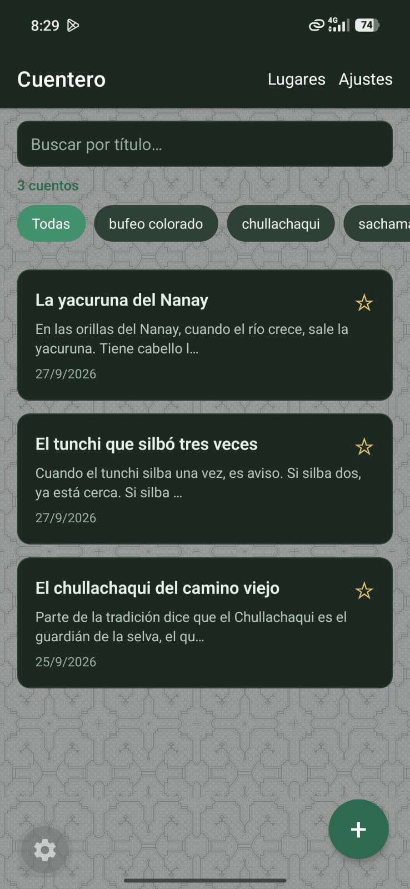
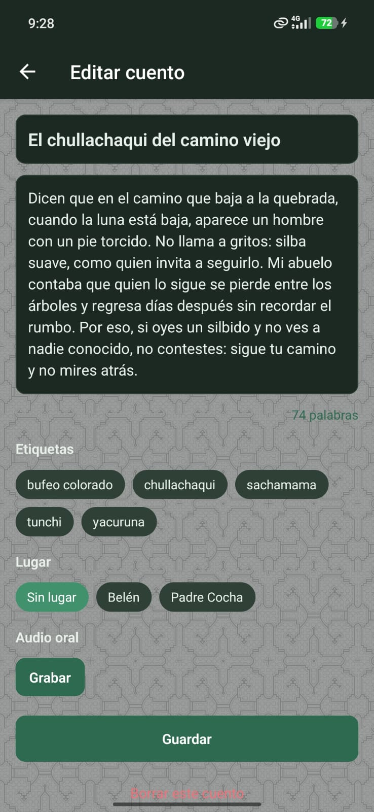
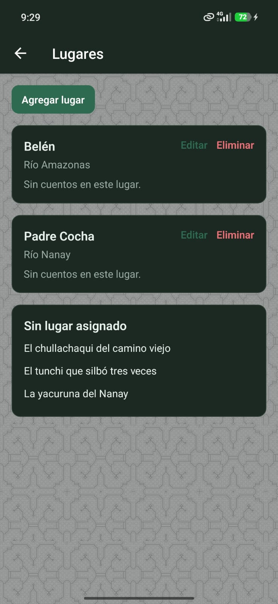

# Cuentero

Aplicación móvil para guardar cuentos en el teléfono. No usa servidor.

**Estudiante:** Said  
**Repositorio:** https://github.com/javapgr/Cuentero_Prismo  
**Paquete Android:** `com.javapgr.cuentero`  
**Base de datos:** `cuentero.db` (SQLite, almacenamiento privado de la app)

## Stack

| Pieza | Versión / uso |
| --- | --- |
| Expo | SDK 57 |
| React | 19.2 |
| React Native | 0.86 |
| Expo Router | Rutas en `app/` (`/`, `/cuento/[id]`, `/ajustes`, `/lugares`) |
| expo-sqlite | CRUD de cuentos, etiquetas y lugares. Consultas con `?` |
| expo-audio | Grabar y reproducir la versión oral |
| expo-file-system + expo-sharing | Exportar `cuentos.md` |
| expo-document-picker | Importar Markdown |

El tema claro u oscuro sale de `useColorScheme()` del sistema.

## Qué hace

- Lista los cuentos. La cabecera dice **Cuentero**. Debajo del buscador muestra el total: **3 cuentos**.
- Filtra el título en SQL: `WHERE titulo LIKE ?`.
- Filtra por etiqueta (`etiqueta`, `cuento_etiqueta`).
- Ordena favoritos primero (`favorito DESC`).
- Muestra una vista previa de unas 80 letras.
- Editor: contador de palabras, alerta si sales con cambios, autoguardado a los 3 segundos. Etiquetas, lugar y audio entran en ese control.
- Lugares: alta, edición y borrado. Al borrar, los cuentos quedan con `lugar_id` nulo.
- Ajustes: exportar e importar Markdown separado por `---`.
- Fondo: textura en `assets/fondo-kene-lineas.png`.

## Instalar en el celular

APK de Android, unas 92 MB. Copia este enlace completo en Chrome del teléfono. La descarga empieza sola. No es la página de Expo y no pide correo.

https://expo.dev/artifacts/eas/dfv0TtildKPdlga1zHDfez5jyYnLiY_vduLxC33fdys.apk

Si WhatsApp parte el enlace, no lo abras desde la vista previa. Pégalo entero en la barra de Chrome. Si el celular pide permiso, activa instalar aplicaciones de origen desconocido.

## Desarrollo

```bash
npm install
npx expo start
```

Misma red Wi-Fi: escanea el QR con Expo Go.

Otra red:

```bash
npx expo start --tunnel
```

Generar otro APK:

```bash
npx eas-cli@latest login
npm run build:apk
```

El perfil `preview` de `eas.json` produce un APK de distribución interna.

## Capturas

Ancho fijo de 220 px para que en GitHub no ocupen toda la página.

<p>
  
  
  
  
  
</p>
